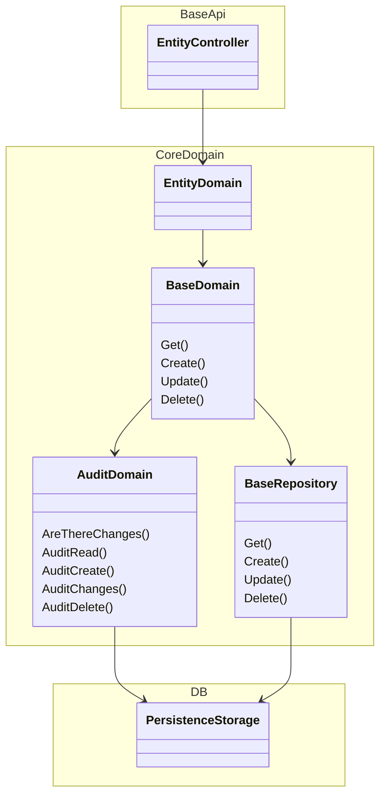

# Goal of project
* Base project and domain layer setup. This is to help start new projects and move things along quickly 
 redo the section above

## Projects
* BaseApi - BE Net Api
* CoreDomain - Base logic layer to make sure consistant CRUD actions
* CoreUtilities - Common extensions, logger and so on

## DI
* DI is setup by each project to be done on its own. 

## Unit tests
* CoreDomainUnitTests
* CoreUtilitiesUnitTests

# To contribute
* To contribute to this everything must be in a PR first. Suggestions always welcome!
