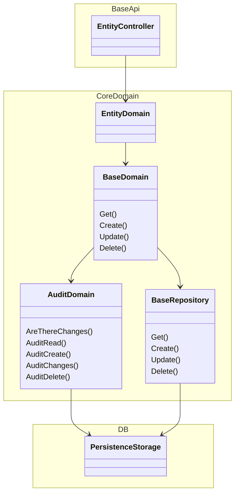

# Goal of project
* Base project and domain layer setup. This is to help start new projects and move things along quickly 
 redo the section above

## Projects
* BaseApi - BE Net Api 
    * Entity (Folder - Plural)
        * EntityController (Plural)
        * EntityRequest/Response (Singular)
            * ToEntity (Function)
            * FromEntity (Function)
* CoreDomain - Base logic layer to make sure consistant CRUD actions
    * EntityDomain (Singular)
        * Entity (Folder - Plural)
            * Repositories (Folder - Plural)
                * EntityRepository (Singular)
            * EntityDomain (Singular)
            * EntityObject (Singular)
* CoreDomainUnitTests - Unit tests around CoreDomain project
* CoreUtilities - Common extensions, logger and so on
* CoreUtilitiesUnitTests - Unit tests around Core Utilities

## Dependency Injection Setup
* DI is setup in each project in a function called "DepenedencySetup"
* To add new DI requirements to a project make sure to update the project's "DepenedencySetup" function

# To contribute
* To contribute to this everything must be in a PR first. Suggestions always welcome!
